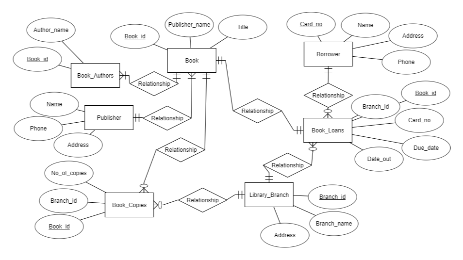

##  Homework 2
####  Sam Chami, Merci Magallanes, and John Scott

###  Chapter 9
3\.  Try to map the relational schema in Figure 6.14 [page 189] into an ER schema. This is part of a process known as _reverse engineering_, in which a conceptual schema is created for an existing implemented database. State any assumptions you make.

> 
> * Assume Book_Id corresponds to uniquely published books
> * Assume Book_Loans is only populated by currently loaned books

7\.  Is it possible to successfully map a binary M:N relationship type without requiring a new relation? Why or why not?

>  No because we cannot represent an M:N relationship
type by a single foreign key attribute in one of the participating relations; therefore we must create a separate _relationship relation_ because of the M:N cardinality ratio.

###  Chapter 10
3\.  Why is it important to design the schemas and applications in parallel?

>  It is important to design them in parallel because they strongly influence one another. For example, by analyzing database
applications, it is possible to identify data items that will be stored in the database and providing insight into data items can help with designing the schemas. Also usually the design of database applications are specified by referring to the database schema constructs.

4\.  Why is it important to use an implementation-independent data model during conceptual schema design? What models are used in current design tools? Why?

>  It is important to use an implementation-independent data model  because each DBMS typically has idiosyncrasies and restrictions that should not be allowed to influence the conceptual schema design. Structural and behavioral diagrams are used in current tools because they result in a more complete specification/description of the overall database application.

6\.  Consider an actual application of a database system of interest. [NOTE: this means pick one you are familiar with to use for this exercise.] Define the requirements of the different levels of users in terms of data needed, types of queries, and transactions to be processed.

>  TODO

###  Chapter 15
5\.  What is a functional dependency? What are the possible sources of the information that defines the functional dependencies that hold among the attributes of a relation schema?

>  TODO

9\.  What undesirable dependencies are avoided when a relation is in 2NF?

>  TODO

10\.  What undesirable dependencies are avoided when a relation is in 3NF?

>  TODO

13\.  What is a multivalued dependency? When does it arise?

>  TODO

###  Chapter 21
1\.  What is meant by the concurrent execution of database transactions in a multiuser system? Discuss why concurrency control is needed, and give informal examples.

>  In a multiuser system, multiple users can access the system at the same time. Concurrent execution refers to the ability for multiple users not only to access information, but submit transactions at the same time. If users were not able to buy games to a sports game concurrently, it would be a slow, nearly impossible process to conveniently get a ticket. For this reason, multiprogramming exists, which allows multiple processes to run at once in a secure fashion, allowing users to independently interact with a database system without the worry of data loss or inaccuracy.
> Concurrency control ensures that two transactions on the same parts of the data set does not occur simultaneously. This needed because users interacting with the same data can cause very costly errors. Without concurrency control, problems can occur in which data is changed while one user is still in the process of his transaction. For example, if two users try and buy the same tickets to a sports game, a lack of concurrency control could cause the ticket to be bought by the first user and the seat to change values before the second user can checkout.

6\.  Discuss the atomicity, durability, isolation, and consistency preservations properties of a database transaction.

>  TODO

###  Chapter 4
1\.  The four fundamental data constructs of Neo4j are [select one and describe each of the items in your selection]:

  > Node, relationship, property, and label
  > * Node: Objects used to store entity information within a graphical model. In a restaurant graphical model, the nodes would be the individual customers, food items, cooks, etc.
  > * Relationship: Connects the nodes to one another, thus giving further information about how they are stored. A relation is attached to a node on both sides and generally have a direction and a type. For example, in a restaurant model, *A customer node* could **order** (Relationship) *a food item node*.
  > * Property: Contained within properties. They operate in key/value object form. There can be multiple properties belonging to a node or relationship. For example, the customer could be named *(key)* Robert *(value)*.
  > * Label: Labels are something that can be assigned to nodes in order to quickly organize and access them without the means of a Node or relationship type. They are usually used for indexing.

3\.  If you have a few entities in your dataset that have lots of relationships to other entities, then you can't use a graph database because of the dense node problem.

  > 2.  True – but there is no alternative, so you will have to live with it
